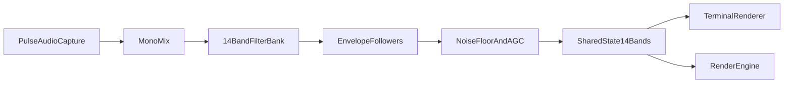

# TeensyVisualizer Algorithm Replacement Plan

**Goal:** Discard the current Raspberry Pi FFT-based spectrum algorithm and replace it with a TeensyVisualizer-inspired 14-band software analyzer, then update the LED and TUI outputs to render those 14 bands directly.

**Reference model:** [TeensyVisualizer](https://github.com/dgorbunov/TeensyVisualizer) uses a 14-band MSGEQ7-style acquisition path with per-band smoothing, noise suppression, and quiet-state dimming. On Raspberry Pi, the practical equivalent is a software filter-bank plus envelope followers, not a direct port of the Arduino sketch’s GPIO/ADC code.

## Current Constraints

- [include/musevis/SharedState.h](/Users/prime/source/MuseVis/include/musevis/SharedState.h) hard-codes `NUM_BANDS = 16` and bakes that into the shared frame contract.
- [src/audio/AudioCapture.cpp](/Users/prime/source/MuseVis/src/audio/AudioCapture.cpp) directly constructs `FFTProcessor`, so capture and analysis are tightly coupled.
- [src/dsp/FFTProcessor.h](/Users/prime/source/MuseVis/src/dsp/FFTProcessor.h) and [src/dsp/FFTProcessor.cpp](/Users/prime/source/MuseVis/src/dsp/FFTProcessor.cpp) implement the existing 2048-point FFT, log-band reduction, and global `runningMax_` normalization that is likely causing the Pi behavior mismatch.
- [src/render/RenderEngine.cpp](/Users/prime/source/MuseVis/src/render/RenderEngine.cpp) and [src/render/TerminalRenderer.cpp](/Users/prime/source/MuseVis/src/render/TerminalRenderer.cpp) both add their own attack/decay smoothing on top of the analyzer output, which will fight a Teensy-style envelope-driven algorithm.
- [CMakeLists.txt](/Users/prime/source/MuseVis/CMakeLists.txt) currently builds both binaries around `FFTProcessor.cpp` and links FFTW into both targets.

## Implementation Plan

### 1. Replace the shared 16-band contract with a 14-band contract

- Update [include/musevis/SharedState.h](/Users/prime/source/MuseVis/include/musevis/SharedState.h) so the published analyzer frame is 14 bands instead of 16.
- Audit any loops, array sizes, stale-frame logic, and LED buffer calculations that assume `NUM_BANDS * LEDS_PER_BAND == 256`.
- Decide early whether LED count stays fixed at 16 LEDs per band while the number of bands drops to 14; if so, update the total pixel count and any comments/spec text accordingly.
- Success criterion: the project has one authoritative 14-band data contract shared by audio and both renderers.

### 2. Introduce an analyzer abstraction and isolate the old FFT path

- Add a narrow analyzer interface, for example `BandAnalyzer`, responsible for consuming interleaved stereo frames and publishing normalized band magnitudes into `SharedState`.
- Refactor [src/audio/AudioCapture.cpp](/Users/prime/source/MuseVis/src/audio/AudioCapture.cpp) to own an analyzer instance rather than directly constructing `FFTProcessor`.
- Move the current FFT implementation behind that interface first so the codebase can switch analyzers without changing capture/threading behavior.
- Success criterion: capture becomes analyzer-agnostic, and the old FFT path can be deleted only after the replacement is proven.

### 3. Implement a TeensyVisualizer-style software analyzer

- Add a new DSP module, such as `FilterBankProcessor`, to replace the FFT/log-bin approach with 14 fixed analysis channels that approximate the TeensyVisualizer band layout and feel.
- The new analyzer should own the behavior that matters in the Arduino project:
  - mono mix from stereo input
  - fixed per-band response instead of shared FFT buckets
  - per-band rectification/RMS and envelope followers
  - per-band smoothing constants tuned to feel like MSGEQ7 output
  - floor suppression / noise gating
  - gentler global conditioning than the current single `runningMax_` reference
- Keep the initial band layout configurable in one small definition file so it can be tuned on Pi hardware without rewriting the analyzer.
- Success criterion: bass no longer dictates the global reference, and mids/highs move independently in a stable way.

### 4. Remove the old normalization model and discard the FFT implementation

- Delete the `runningMax_`-driven normalization behavior from the active analysis path once the filter-bank analyzer is working.
- Remove or retire [src/dsp/BandMapper.h](/Users/prime/source/MuseVis/src/dsp/BandMapper.h), [src/dsp/FFTProcessor.h](/Users/prime/source/MuseVis/src/dsp/FFTProcessor.h), and [src/dsp/FFTProcessor.cpp](/Users/prime/source/MuseVis/src/dsp/FFTProcessor.cpp) from the main build after the new analyzer fully replaces them.
- Update [CMakeLists.txt](/Users/prime/source/MuseVis/CMakeLists.txt) to compile the new analyzer sources and drop FFT-specific wiring if FFTW is no longer needed.
- Success criterion: the shipping build no longer depends on the old FFT analyzer.

### 5. Rework both renderers around 14 real analysis bands

- Update [src/render/RenderEngine.cpp](/Users/prime/source/MuseVis/src/render/RenderEngine.cpp) to iterate over 14 bands, regenerate hue spacing for 14 columns, and recalculate LED buffer sizing.
- Update [src/render/TerminalRenderer.cpp](/Users/prime/source/MuseVis/src/render/TerminalRenderer.cpp) to use 14 labels/columns and remove FFT-era frequency labels that no longer match the analyzer.
- Reduce renderer-side attack/decay so the analyzer owns most of the motion profile; keep only light presentation smoothing or peak decoration if still useful.
- Revisit stale-frame and silence behavior so quiet handling comes from analyzer energy state rather than only “no new frame” detection.
- Success criterion: both outputs visually reflect the new algorithm rather than reinterpreting it through the old smoothing logic.

### 6. Update docs and validation workflow for Raspberry Pi tuning

- Update [SPEC.md](/Users/prime/source/MuseVis/SPEC.md) to describe the new 14-band architecture, replacing the FFT/log-band narrative with the Teensy-inspired filter/envelope pipeline.
- Add a small debug/validation path if needed so the same captured audio can be inspected band-by-band while tuning thresholds, release times, and noise floor.
- Validate on Raspberry Pi with silence, speech, bass-heavy music, and transient-heavy music to confirm the replacement actually fixes the visual mismatch.
- Success criterion: there is a repeatable tuning loop for Pi hardware instead of relying only on visual guesswork.

## Key Risks

- TeensyVisualizer’s exact band behavior is partly created by MSGEQ7 hardware, so the Pi implementation must approximate that behavior rather than literally copy Arduino reads.
- Moving from 16 to 14 bands changes LED layout assumptions and terminal labeling, so renderer changes are part of the algorithm replacement, not optional cleanup.
- If the analyzer and renderers both continue smoothing aggressively, the output will still feel wrong even after the DSP swap.

## Verification

- Confirm both `musevis` and `musevis-tui` build against the new analyzer path.
- Compare old vs new behavior on the same Raspberry Pi audio source before deleting the FFT code.
- Verify silence handling, decay speed, and per-band independence on-device before considering the migration complete.